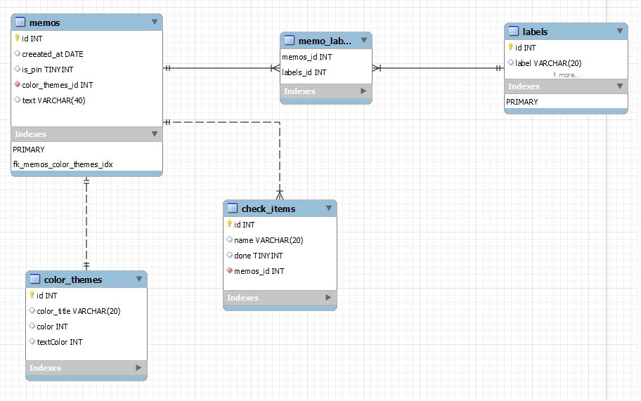
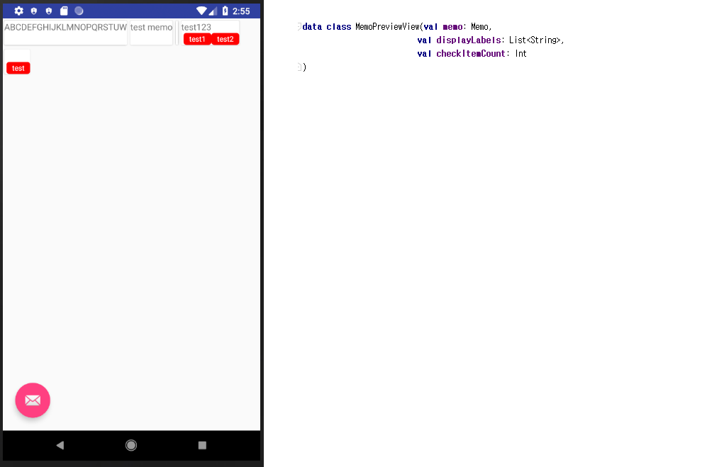
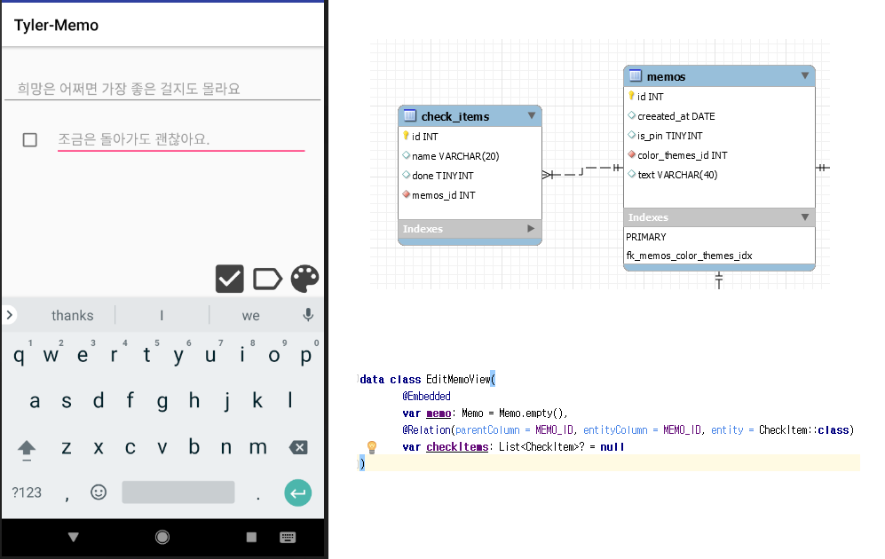
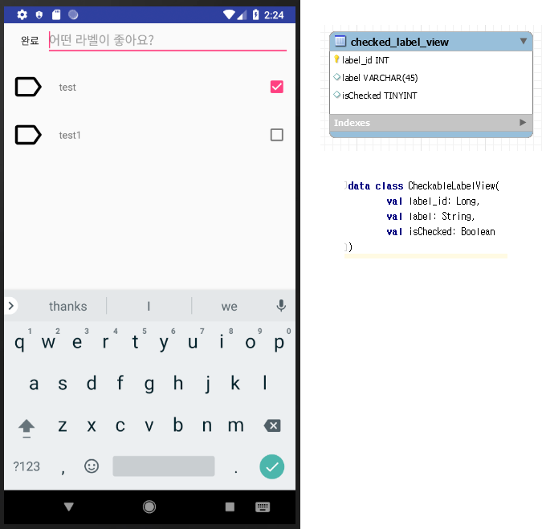
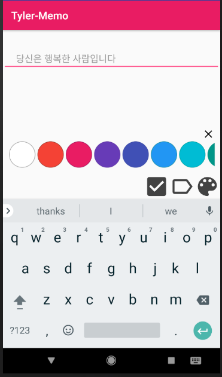

# TylerMemo

## Languages, libraries and tools used

* [Kotlin](https://kotlinlang.org/)
* [RxKotlin](https://github.com/ReactiveX/RxKotlin)
* [Databinding](https://developer.android.com/topic/libraries/data-binding/?hl=ko)
* [Jetpack](https://developer.android.com/jetpack/)
* [Dagger2](https://github.com/google/dagger)
* [Retrofit](https://github.com/square/retrofit)
* [Firebase](https://firebase.google.com/docs/android/setup?hl=ko)
* [Mockito](https://github.com/mockito/mockito)
* [Timber](https://github.com/JakeWharton/timber)

## Database


### Queries

#### MemoPreview


[MemoLabelJoinDao.kt](app/main/java/com/hucet/tyler/memo/repository/memolabel/MemoLabelJoinDao.kt)

[TestCase](app/src/test/java/com/hucet/tyler/memo/repository/MemoLabelRepositoryTest.kt) line: 168

```kotlin
    fun searchMemoView(keyword: String, isPinSort: Boolean = true): LiveData<List<MemoPreviewView>> {
        return Transformations.map(dao.searchMemoView(keyword.fullTextSql(), true)) {
            it.map {
                MemoPreviewView(it.memo, it.labels ?: emptyList(), it.checkItemCount)
            }
        }
    }
```
SQL
```kotlin
    @Transaction
    @Query("""
        SELECT *, (SELECT GROUP_CONCAT(labels.label)
        FROM memo_label_join
        LEFT JOIN labels
        ON labels.label_id = memo_label_join.label_id
        WHERE memo_label_join.memo_id = memos.memo_id) as concatLabels,
        (SELECT count(check_items.check_item_id)
        FROM check_items
        WHERE memos.memo_id = check_items.memo_id) as checkItemCount

        FROM memos
        where memos.text LIKE  :keyword
        order by
        case :isPinDesc when 1 then memos.isPin end desc, createAt desc
    """)
    internal abstract fun searchMemoView(keyword: String, isPinDesc: Boolean): LiveData<List<MemoViewDto>>
```

#### EditMemoView


[MemoDao.kt](app/main/java/com/hucet/tyler/memo/repository/memo/MemoDao.kt)

[TestCase](app/src/test/java/com/hucet/tyler/memo/repository/MemoRepositoryTest.kt) line: 73
```kotlin
@Transaction
    @Query("""select *
        from memos
        where memo_id = :id
        """)
    abstract fun findMemoById(id: Long): LiveData<EditMemoView>
```
#### CheckableLabelView


[MemoLabelJoinDao.kt](app/main/java/com/hucet/tyler/memo/repository/memolabel/MemoLabelJoinDao.kt)

[TestCase](app/src/test/java/com/hucet/tyler/memo/repository/MemoLabelRepositoryTest.kt) line: 60
```kotlin
@Query("""
        select l.label_id, l.label, (
            SELECT count(m.label_id)
            FROM memo_label_join as m
            WHERE m.memo_id = :memoId and l.label_id = m.label_id
            Limit 1
       ) as isChecked
            from labels as l
            where label LIKE  :keyword
        """
    )
    abstract fun searchCheckedLabels(keyword: String, memoId: Long): LiveData<List<CheckableLabelView>>
```
#### ColorTheme

[ColorThemeDao.kt](app/main/java/com/hucet/tyler/memo/repository/colortheme/ColorThemeDao.kt)

[TestCase](app/src/test/java/com/hucet/tyler/memo/repository/colortheme/ColorThemeRepositoryTest.kt)
```kotlin
@Query("""
    select *
        from color_themes
      INNER JOIN memos
      ON memos.memo_id = :memoId
    """
)
abstract fun getColorThemeByMemoId(memoId: Long): LiveData<ColorTheme>
```